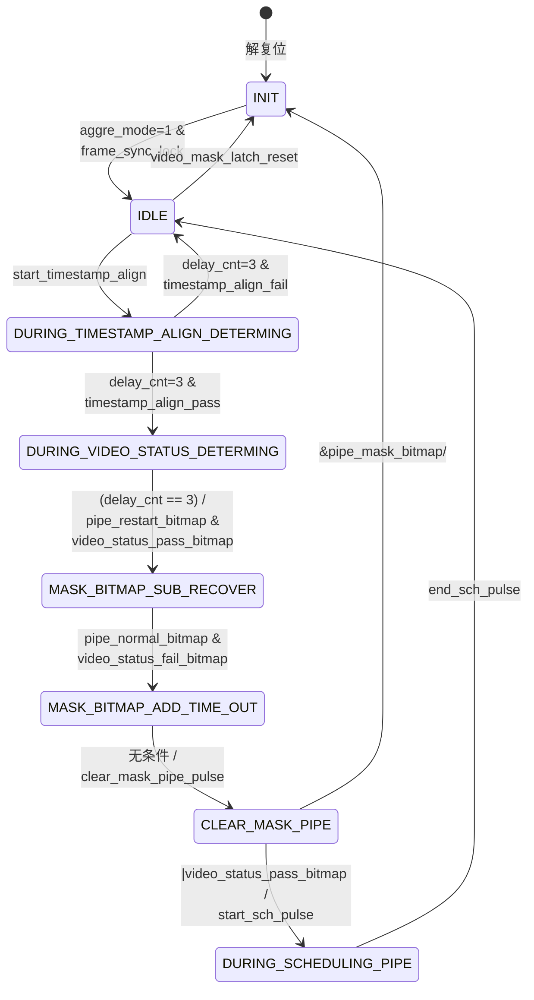
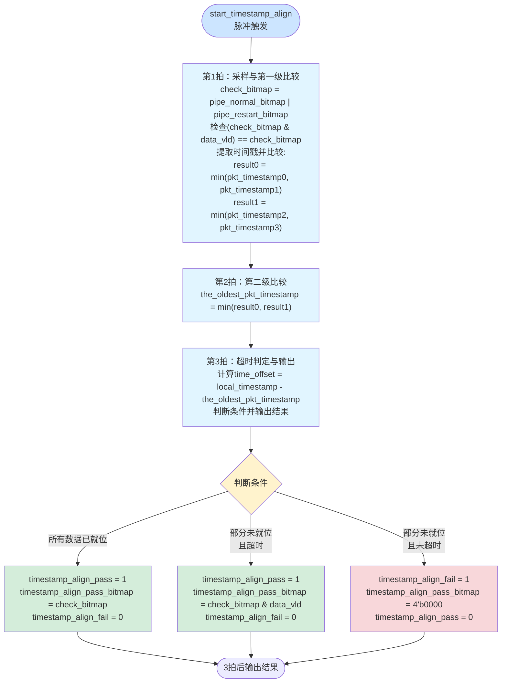
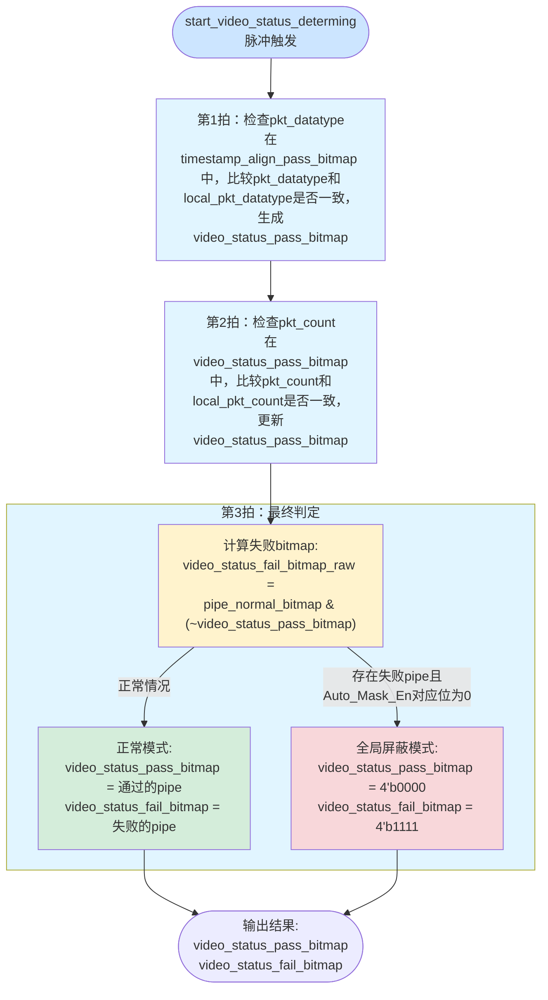

## 视频管道屏蔽详细设计 - pipe_mask_ctrl

### 1. 模块概述

#### 1.1 功能说明

本模块作为视频管道屏蔽的顶层控制器，负责管理4路视频pipe的屏蔽状态。

- 通过配置信号实现本地 pipe_mask_bitmap 维护
- 输出 pipe_normal_bitmap/pipe_restart_bitmap 给子模块进行判定
- 子模块 timestamp_align_determination 通过检查4路fwft_fifo的有效出口数据，判断pipe是否对齐成功
- 子模块 video_status_determination 检查数据包的datatype序列和pkt_count正确性，输出pass/fail位图
- **配置锁定**: `Force_Video_Mask`和`Auto_Mask_En`仅在INIT状态采样并锁存（防止中途修改），`Video_Mask_Restart_En`实时响应
- **输出信号**: `pipe_clear_pulse`和`start_sch_pulse`为单周期边沿脉冲，`pipe_wr_mode`为8-bit电平信号(2bit×4pipe扩展自pipe_mask_bitmap)

### 2. 接口定义

#### 2.1 输入输出端口

| 端口名 | I/O | 位宽 | 描述 |
| :--- | :-: | :--- | :--- |
| `clk` | I | 1 | 入口时钟 |
| `rst_n` | I | 1 | 异步复位，低有效 |
| `pipe_concat_en`| I | 4 |   **【配置寄存器】**  同步汇聚pipe使能 |
| `Force_Video_Mask`| I | 4 |   **【配置寄存器】**  强制屏蔽-使能 |
| `Auto_Mask_En` | I | 4 |   **【配置寄存器】**  自动屏蔽-使能 |
| `Video_Mask_Restart_En` | I | 4 |    **【配置寄存器】**  自动屏蔽-退出屏蔽  |
| `pipe_frame_active` | I | 4 |    **【from video_pipe】**  识别到有FS进入pipe  |
| `frame_sync_lock`| I | 1 |  **【配置寄存器】** 帧锁定标志位 |
| `aggre_mode`| I | 2 | **【配置寄存器】** 汇聚模式<br> 2'b01: 同步汇聚w4h模式 <br> 2'b10: 异步汇聚模式1<br> 2'b11: 异步汇聚模式2|
| `video_mask_latch_reset`| I | 1 | **【配置寄存器】** 重置pipe_mask_bitmap到初始状态 |
| `data_vld`| I | 4 | **【from fwft_fifo】** FIFO出口数据有效位 |
| `data_0`| I | 102 | **【from fwft_fifo】** FIFO_0出口数据 |
| `data_1`| I | 102 | **【from fwft_fifo】** FIFO_1出口数据 |
| `data_2`| I | 102 | **【from fwft_fifo】** FIFO_2出口数据 |
| `data_3`| I | 102 | **【from fwft_fifo】** FIFO_3出口数据 |
| `local_timestamp`| I | 80 | **【from us_counter】** 本地us计数器值 |
| `reg_sync_aggr_video_timeout_threshold`| I | 20 | **【配置寄存器】** 同步汇聚超时阈值 |
| `pipe_clear_pulse`| O | 4 | **【to video_pipe】** 控制video_pipe 缓存清空（脉冲信号） |
| `pipe_wr_mode`| O | 8 | **【to video_pipe】** 控制video_pipe 入口写入状态（2bit×4pipe） |
| `start_sch_pulse`| O | 1 | **【to sch_concat】** 启动同步汇聚（脉冲信号） |
| `end_sch_pulse`| I | 1 | **【from sch_concat】** 结束同步汇聚 |
| `pipe_mask_bitmap`| O | 4 | **【状态输出】** 当前pipe屏蔽位图 |
| `pipe_normal_bitmap`| O | 4 | **【状态输出】** 正常工作pipe位图 |
| `pipe_restart_bitmap`| O | 4 | **【状态输出】** 尝试恢复pipe位图 |

#### 2.2 内部信号

| 内部关键变量 | 类型 | 位宽 | 描述 |
| :--- | :-: | :--- | :--- |
| `delay_cnt`| reg | 4 | 延迟计数器（用于3拍流水线） |
| `local_force_video_mask`| reg | 4 | INIT状态锁存的Force_Video_Mask |
| `local_auto_mask_en`| reg | 4 | INIT状态锁存的Auto_Mask_En |
| `fault_clear_mask_pipe_error`| reg | 1 | 内部debug故障标志 |
| `pipe_normal_bitmap`| wire | 4 | 等于~pipe_mask_bitmap & pipe_concat_en |
| `pipe_restart_bitmap`| wire | 4 | 等于 pipe_mask_bitmap & Video_Mask_Restart_En & pipe_frame_active |
| `start_timestamp_align`| wire | 1 | 状态转换触发的脉冲信号（IDLE→DURING_TIMESTAMP_ALIGN_DETERMING） |
| `timestamp_align_pass`| wire | 1 | 由timestamp_align_determination子模块输出 |
| `timestamp_align_fail`| wire | 1 | 由timestamp_align_determination子模块输出 |
| `timestamp_align_pass_bitmap`| wire | 4 | 由timestamp_align_determination子模块输出 |
| `start_video_status_determing`| wire | 1 | 状态转换触发的脉冲信号 |
| `video_status_pass_bitmap`| wire | 4 | 由video_status_determination子模块输出 |
| `video_status_fail_bitmap`| wire | 4 | 由video_status_determination子模块输出 |

### 3. 子模块集成

#### 3.1 timestamp_align_determination 子模块

**功能**: 时戳对齐判定

**连接关系**:

- 触发: start_timestamp_align (IDLE→DURING_TIMESTAMP_ALIGN_DETERMING状态转换边沿脉冲)
- 输入: pipe_normal_bitmap, pipe_restart_bitmap, data_vld[3:0], data_[0-3], local_timestamp, reg_sync_aggr_video_timeout_threshold
- 输出: timestamp_align_pass, timestamp_align_fail, timestamp_align_pass_bitmap

#### 3.2 video_status_determination 子模块

**功能**: 视频状态判定

**连接关系**:

- 触发: start_video_status_determing (DURING_TIMESTAMP_ALIGN_DETERMING→DURING_VIDEO_STATUS_DETERMING状态转换边沿)
- 输入: timestamp_align_pass_bitmap, data_vld[3:0], data_[0-3], local_auto_mask_en
- 输出: video_status_pass_bitmap, video_status_fail_bitmap

**特殊功能**:

- 当local_auto_mask_en[i]=0且检测到超时时，强制video_status_fail_bitmap=4'b1111（全局暂停）

### 4. 状态机设计

#### 4.1 状态转换图



#### 4.2 状态详细描述

**INIT - 初始化状态**

- next触发：无
- curt跳转：等待frame_sync_lock和aggre_mode=2'b01信号，跳转至IDLE

**IDLE - 空闲状态**

- next触发：从INIT跳转，则重置pipe_mask_bitmap到初始状态（`pipe_concat_en & local_force_video_mask`，使用INIT状态锁存的配置）
- curt跳转：
  - 手动触发video_mask_latch_reset跳转至INIT
  - 条件触发(|(pipe_normal_bitmap|pipe_restart_bitmap & data_vld))跳转至DURING_TIMESTAMP_ALIGN_DETERMING

**DURING_TIMESTAMP_ALIGN_DETERMING - 判断视频包对齐**

- next触发：
  - 进行视频包对齐检测，仅检测当前 pipe_normal_bitmap 置高的pipe，计算过程需要3拍
  - 进入该状态时 delay_cnt 置为1，然后递增：1→2→3
- curt跳转：
  - delay_cnt=3（第3拍）时结束该状态，对齐成功 timestamp_align_pass 则携带 timestamp_align_pass_bitmap ，跳转至DURING_VIDEO_STATUS_DETERMING
  - delay_cnt=3（第3拍）时结束该状态，对齐失败timestamp_align_fail则跳转至IDLE

**DURING_VIDEO_STATUS_DETERMING - 判断视频包正确**

- next触发：
  - 进行视频状态判定，仅判定 timestamp_align_pass_bitmap 至高的pipe, 计算过程需要3拍
  - 进入该状态时 delay_cnt 置为1，然后递增：1→2→3
- curt跳转：delay_cnt=3（第3拍）时结束该状态，跳转至 MASK_BITMAP_SUB_RECOVER

**MASK_BITMAP_SUB_RECOVER - 根据视频restart状态对mask清0**

- next触发：按 `pipe_mask_bitmap <= pipe_mask_bitmap & (~(pipe_restart_bitmap & video_status_pass_bitmap))` 逻辑，将通过对齐的pipe从mask中移除
- curt跳转：下拍跳转至 MASK_BITMAP_ADD_TIME_OUT

**MASK_BITMAP_ADD_TIME_OUT - 根据视频normal状态对mask置1**

- next触发：
  - 按 `pipe_mask_bitmap <= pipe_mask_bitmap | (pipe_normal_bitmap & video_status_fail_bitmap)` 逻辑，将检测失败的pipe加入mask
  - 特殊情况：当`local_auto_mask_en==4'b0000`时，任何fail触发全局屏蔽(`video_status_fail_bitmap=4'b1111`)
- curt跳转：下拍跳转至 CLEAR_MASK_PIPE

**CLEAR_MASK_PIPE - 对mask状态的pipe发起缓存清空脉冲**

- next触发：触发 pipe_clear_pulse 脉冲，清空相应video_pipe缓存
- curt跳转：
  - 条件 |video_status_pass_bitmap 判断成功，跳转至DURING_SCHEDULING_PIPE
  - 条件 &pipe_mask_bitmap 判断成功，跳转至INIT

**DURING_SCHEDULING_PIPE - pipe_mask_bitmap清0状态**

- next触发：触发start_sch_pulse脉冲
- curt跳转：收到 end_sch_pulse脉冲，跳转至IDLE

---

## 子模块详细设计

### 子模块1: timestamp_align_determination - 时戳对齐判定

#### 1. 输入输出接口

| 端口名 | I/O | 位宽 | 描述 |
| :--- | :-: | :--- | :--- |
| `clk` | I | 1 | 入口时钟 |
| `rst_n` | I | 1 | 异步复位，低有效 |
| `reg_sync_aggr_video_timeout_threshold` | I | 20 | 同步汇聚视频包等待超时阈值 |
| `pipe_normal_bitmap` | I | 4 | 指示哪些normal pipe需要检测时戳对齐-来自pipe_mask_bitmap |
| `pipe_restart_bitmap` | I | 4 | 指示哪些restart pipe需要检测时戳对齐-来自pipe_frame_active |
| `data_vld_0` | I | 1 | fwft_fifo_0出口数据有效位 |
| `data_vld_1` | I | 1 | fwft_fifo_1出口数据有效位 |
| `data_vld_2` | I | 1 | fwft_fifo_2出口数据有效位 |
| `data_vld_3` | I | 1 | fwft_fifo_3出口数据有效位 |
| `data_0` | I | 102 | fwft_fifo_0出口数据 |
| `data_1` | I | 102 | fwft_fifo_1出口数据 |
| `data_2` | I | 102 | fwft_fifo_2出口数据 |
| `data_3` | I | 102 | fwft_fifo_3出口数据 |
| `local_timestamp` | I | 80 | 当前本地us计数器值 |
| `start_timestamp_align` | I | 1 | 开始进行时戳对齐判定 |
| `timestamp_align_pass` | O | 1 | 时戳对齐成功 |
| `timestamp_align_fail` | O | 1 | 时戳对齐失败 |
| `timestamp_align_pass_bitmap` | O | 4 |  表示时戳对齐成功时，对应的pipe位 |

#### 2. 功能原理

本模块通过比较4个fwft_fifo的空满状态和本地时戳,判断当前需要检测的pipe（pipe_normal_bitmap | pipe_restart_bitmap）中哪些可以不再等待。

##### 2.1 数据格式定义

FWFT_FIFO data[101:0] 位域定义：

| 位域 | 描述 |
| :--- | :--- |
| `[79:0]` | pkt_timestamp[79:0]: 接收到包结束时，us计数器的值（video_pipe模块中维护） |
| `[95:80]` | pkt_count[15:0]: 接收到包的id，表示帧号或行号 |
| `[101:96]` | pkt_datatype[5:0]: 接收到的包类型，含FS/FE/LONG_PACKET/LS/LE |

##### 2.2 核心逻辑

1. **所有数据已就位：** 如果检测位图（`pipe_normal_bitmap | pipe_restart_bitmap`）对应的所有FIFO都非空（`((pipe_normal_bitmap | pipe_restart_bitmap) & data_vld) == (pipe_normal_bitmap | pipe_restart_bitmap)`），直接判定对齐成功，交给后续逻辑判断包是否正确
2. **部分数据未就位：** 如果有FIFO为空（`data_vld`为0），则：
   - 从非空FIFO中找出最老的包时间戳（the_oldest_pkt_timestamp）
   - 计算：time_offset = local_timestamp - the_oldest_pkt_timestamp
   - 若 time_offset >= 阈值：说明未就位的pipe已经晚了很长时间，不再等待，输出align_pass
   - 若 time_offset < 阈值：可以继续等待，输出align_fail，状态机返回IDLE重新触发

##### 2.3 触发机制

- 顶层状态机在IDLE时，只要`(pipe_normal_bitmap | pipe_restart_bitmap) & data_vld`有任意位为1，就会触发`start_timestamp_align`（脉冲信号）
- 同时检测正常工作的pipe（pipe_normal_bitmap）和尝试恢复的pipe（pipe_restart_bitmap）
- 检测位图内部合并：`check_bitmap = pipe_normal_bitmap | pipe_restart_bitmap`，同时检测正常和重启pipe

##### 2.4 FIFO状态判断

- 采用FWFT（First Word Fall Through）FIFO，通过`data_vld`信号判断FIFO是否有有效数据
- `data_vld[i] = 1`表示FIFO_i有有效数据（非空）
- `data_vld[i] = 0`表示FIFO_i无有效数据（空）

##### 2.5 时间戳特性

- 80bit us计数器不会溢出回绕，足够运行多年
- 所有信号在统一时钟域下工作，无需跨时钟域处理

#### 3. 流程图

##### 3.1 流水线实现

本模块采用3拍流水线处理（从`start_timestamp_align`脉冲触发开始计数，3拍后输出结果）：

**第1拍：采样与第一级比较**

- 采样输入信号，合并检测位图：`check_bitmap = pipe_normal_bitmap | pipe_restart_bitmap`
- 检查`(check_bitmap & data_vld) == check_bitmap`是否成立（所有需要检测的pipe数据都就位）
- 从有效FIFO（`check_bitmap & data_vld`对应位为1）中提取时间戳字段：`data[79:0]`
- 进行第一级时间戳比较：`pkt_timestamp0 vs pkt_timestamp1`得到`result0`，`pkt_timestamp2 vs pkt_timestamp3`得到`result1`

**第2拍：第二级比较**

- 完成第二级时间戳比较：`result0 vs result1`，找出最老的时间戳（the_oldest_pkt_timestamp）

**第3拍：超时判定与输出**

- 计算：`time_offset = local_timestamp - the_oldest_pkt_timestamp`
- 判断输出结果：
  - 若`(check_bitmap & data_vld) == check_bitmap`：所有数据已就位，输出`timestamp_align_pass = 1, timestamp_align_pass_bitmap = check_bitmap`
  - 若部分数据未就位且`time_offset >= threshold`：等待超时，输出`timestamp_align_pass = 1, timestamp_align_pass_bitmap = check_bitmap & data_vld`
  - 若部分数据未就位且`time_offset < threshold`：继续等待，输出`timestamp_align_fail = 1, timestamp_align_pass_bitmap = 4'b0000`

##### 3.2 Mermaid流程图



#### 4. 硬件资源与实现细节

##### 4.2 流水线结构

- 固定3拍流水线，无预检查快速通路，统一在第3拍输出结果

##### 4.3 运算资源

- **比较器**: 使用3个80bit比较器进行流水线比较（找出最老的包时间戳）
- **减法器**: 1个80bit减法器计算 time_offset = local_timestamp - the_oldest_pkt_timestamp
- **阈值比较**: 1个80bit比较器判断是否超过阈值，阈值扩展到80bit：`time_offset >= {60'b0, reg_sync_aggr_video_timeout_threshold}`

##### 4.4 输出规则

- 所有数据就位时：`timestamp_align_pass_bitmap = check_bitmap`（包含normal和restart pipe）
- 部分数据超时时：`timestamp_align_pass_bitmap = check_bitmap & data_vld`
- 继续等待时：`timestamp_align_pass_bitmap = 4'b0000`

##### 4.5 复位行为

异步复位`rst_n`时：

- `timestamp_align_pass = 1'b0`
- `timestamp_align_fail = 1'b1`（默认失败状态，等待触发）
- `timestamp_align_pass_bitmap = 4'b0000`

##### 4.6 时钟域与时间戳

- 所有信号在统一时钟域下工作，无CDC问题
- 时间戳提取：直接使用`data[79:0]`作为时间戳，无需额外字段校验

---

### 子模块2: video_status_determination - 视频状态判定

#### 1. 输入输出接口

| 端口名 | I/O | 位宽 | 描述 |
| :--- | :-: | :--- | :--- |
| `clk` | I | 1 | 入口时钟 |
| `rst_n` | I | 1 | 异步复位，低有效 |
| `Auto_Mask_En` | I | 4 | 自动屏蔽使能配置（来自INIT状态锁存） |
| `pipe_normal_bitmap` | I | 4 | 指示哪些normal pipe需要检测时戳对齐-来自pipe_mask_bitmap |
| `timestamp_align_pass_bitmap` | I | 4 | 时戳对齐成功的pipe位图 |
| `data_vld_0` | I | 1 | fwft_fifo_0出口数据有效位 |
| `data_vld_1` | I | 1 | fwft_fifo_1出口数据有效位 |
| `data_vld_2` | I | 1 | fwft_fifo_2出口数据有效位 |
| `data_vld_3` | I | 1 | fwft_fifo_3出口数据有效位 |
| `data_0` | I | 102 | fwft_fifo_0出口数据 |
| `data_1` | I | 102 | fwft_fifo_1出口数据 |
| `data_2` | I | 102 | fwft_fifo_2出口数据 |
| `data_3` | I | 102 | fwft_fifo_3出口数据 |
| `check_video_pkt_datatype` | I | 1 | 使能检查视频包datatype |
| `check_video_pkt_count` | I | 1 | 使能检查视频包count，表示帧号或行号 |
| `local_pkt_datatype` | I | 6 | 本地datatype |
| `local_pkt_count` | I | 16 | 本地count，表示帧号或行号 |
| `start_video_status_determing` | I | 1 | 开始进行视频状态判定 |
| `video_status_pass_bitmap` | O | 4 | 视频状态判定成功的pipe位图 |
| `video_status_fail_bitmap` | O | 4 | 视频状态判定失败的pipe位图 |

#### 2. 功能原理

本模块通过检查4个fwft_fifo出口数据的datatype序列和pkt_count正确性，判断timestamp_align_pass_bitmap对应的pipe中哪些视频包格式正确。

##### 2.1 数据格式定义

FWFT_FIFO data[101:0] 位域定义：

| 位域 | 描述 |
| :--- | :--- |
| `[79:0]` | pkt_timestamp[79:0]: 接收到包结束时，us计数器的值 |
| `[95:80]` | pkt_count[15:0]: 接收到包的序号，表示帧号或行号 |
| `[101:96]` | pkt_datatype[5:0]: 包类型（FS/FE/LONG_PACKET/LS/LE） |

**datatype定义**：

- FS (Frame Start): 帧起始包
- FE (Frame End): 帧结束包
- LONG_PACKET: 长包数据
- LS (Line Start): 行起始包
- LE (Line End): 行结束包

##### 2.2 核心逻辑

1. **正常序列检测：** 检查输入视频包的datatype是否和本地预期一致（如 FS → LS → LONG_PACKET → LE → FE）
2. **帧ID连续性：** 检查输入视频包的pkt_count是否和本地预期一致（如连续递增）
3. **全局失败处理：** 当`Auto_Mask_En == 4'b0000`时，任何一个pipe失败都触发全局屏蔽（`video_status_fail_bitmap = 4'b1111`）

##### 2.3 触发机制

- 顶层状态机从DURING_TIMESTAMP_ALIGN_DETERMING转换到DURING_VIDEO_STATUS_DETERMING时触发`start_video_status_determing`（脉冲信号）
- 仅检测timestamp_align_pass_bitmap对应位为1的pipe
- 所有计算过程需要3拍流水线

##### 2.4 检测规则
  
- **检测使能信号作用**（流水线使能）：
  - `check_video_pkt_datatype`：在第1拍启用datatype比较器
  - `check_video_pkt_count`：在第2拍启用pkt_count比较器（**需要锁存一拍与data对齐**）
  - 这两个信号由 `pipe_mask_ctrl` 根据当前期望的包类型动态生成
  - 例如：检查FS/FE包时，可能只检查datatype不检查count；检查LONG_PACKET时，两者都检查

- **local参数维护**：
  - 本模块无需关注 `local_pkt_count` 和 `local_pkt_datatype` 的更新逻辑
  - 这些参数由 `pipe_mask_ctrl` 模块维护内置local寄存器并传入
  - 更新时机：根据视频包序列状态机（FS→LONG_PACKET→FE）自动推进

| 端口名 | I/O | 位宽 | 描述 |
| :--- | :-: | :--- | :--- |
| `timestamp_align_pass_bitmap` | I | 4 | 时戳对齐成功的pipe位图 |
| `data_vld_0` | I | 1 | fwft_fifo_0出口数据有效位 |
| `data_vld_1` | I | 1 | fwft_fifo_1出口数据有效位 |
| `data_vld_2` | I | 1 | fwft_fifo_2出口数据有效位 |
| `data_vld_3` | I | 1 | fwft_fifo_3出口数据有效位 |
| `data_0` | I | 102 | fwft_fifo_0出口数据 |
| `data_1` | I | 102 | fwft_fifo_1出口数据 |
| `data_2` | I | 102 | fwft_fifo_2出口数据 |
| `data_3` | I | 102 | fwft_fifo_3出口数据 |
| `check_video_pkt_datatype` | I | 1 | 使能检查视频包datatype |
| `check_video_pkt_count` | I | 1 | 使能检查视频包count，表示帧号或行号 |
| `local_pkt_datatype` | I | 6 | 本地datatype |
| `local_pkt_count` | I | 16 | 本地count，表示帧号或行号 |
| `start_video_status_determing` | I | 1 | 开始进行视频状态判定 |

##### 2.5 输出规则

- **Pass条件：** datatype序列正确且pkt_count符合预期
- **Fail条件：** datatype序列错误或pkt_count不连续
- **特殊情况：** `Auto_Mask_En == 4'b0000`时，单个失败导致全局失败

#### 3. 流程图

##### 3.1 流水线实现

本模块采用3拍流水线处理（从`start_video_status_determing`脉冲触发开始计数，3拍后输出结果）：

**第1拍：datatype检测**

- 采样 `timestamp_align_pass_bitmap` 作为检测位图
- 提取各pipe的datatype字段：`pkt_datatype[i] = data_i[101:96]`
- 与 `local_pkt_datatype` 比较，受 `check_video_pkt_datatype` 使能控制
- 锁存数据供第2拍使用，同时锁存 `check_video_pkt_count`（与数据对齐）
- 输出：`stage1_pass_bitmap`（datatype匹配的pipe）

**第2拍：pkt_count检测**

- 从锁存的数据提取count字段：`pkt_count[i] = stage1_data_i[95:80]`
- 与 `local_pkt_count` 比较，受锁存的 `check_video_pkt_count_stage1` 使能控制
- 仅检查第1拍通过的pipe（`stage1_pass_bitmap[i] == 1`）
- 输出：`stage2_pass_bitmap`（datatype和count都匹配的pipe）

**第3拍：全局判定与输出**

- 计算失败bitmap：`video_status_fail_bitmap_raw = pipe_normal_bitmap & (~stage2_pass_bitmap)`
- 判断全局屏蔽触发：`global_mask_trigger = |(video_status_fail_bitmap_raw & (~Auto_Mask_En))`
- 若触发全局屏蔽，输出全1失败；否则输出实际检测结果

##### 3.2 Mermaid流程图



#### 4. 硬件资源与实现细节

##### 4.1 流水线结构

- 固定3拍流水线，无预检查快速通路，统一在第3拍输出结果
- 第1拍和第2拍均为比较+筛选操作，逐级缩小通过范围

##### 4.2 运算资源

- **6bit比较器**: 4个，用于第1拍datatype比较（`pkt_datatype[i] == local_pkt_datatype`）
- **16bit比较器**: 4个，用于第2拍count比较（`pkt_count[i] == local_pkt_count`）
- **逻辑门**: 用于bitmap的与/或/非运算

##### 4.3 数据锁存需求

- **关键**：`check_video_pkt_count` 必须在第1拍锁存，作为 `check_video_pkt_count_stage1` 在第2拍使用
- 原因：保证检测使能信号与数据流对齐，避免时序错配
- 额外锁存：`data_i[95:0]` 需要在第1拍锁存到 stage1 寄存器，供第2拍提取count

##### 4.4 关键设计要点

1. **失败bitmap计算**：
   ```verilog
   video_status_fail_bitmap_raw = pipe_normal_bitmap & (~stage2_pass_bitmap)
   ```
   使用 `pipe_normal_bitmap` 而非 `timestamp_align_pass_bitmap`，只关心正常工作pipe的失败

2. **全局屏蔽触发条件**：
   ```verilog
   global_mask_trigger = |(video_status_fail_bitmap_raw & (~Auto_Mask_En))
   ```
   任一失败pipe的 `Auto_Mask_En=0` 时触发全局屏蔽

3. **条件检测逻辑**：
   - 第1拍：`if (check_bitmap[i] && check_video_pkt_datatype) compare_datatype`
   - 第2拍：`if (stage1_pass_bitmap[i] && check_video_pkt_count_stage1) compare_count`
   - 检测使能为0时，默认通过该项检测

##### 4.5 输出规则

- **正常模式**（`global_mask_trigger == 0`）：
  - `video_status_pass_bitmap = stage2_pass_bitmap`
  - `video_status_fail_bitmap = video_status_fail_bitmap_raw`
  
- **全局屏蔽模式**（`global_mask_trigger == 1`）：
  - `video_status_pass_bitmap = 4'b0000`
  - `video_status_fail_bitmap = 4'b1111`

##### 4.6 复位行为

异步复位`rst_n`时：

- 所有流水线寄存器清零
- 输出默认值：`video_status_pass_bitmap = 4'b0000`, `video_status_fail_bitmap = 4'b0000`

##### 4.7 时钟域与接口

- 所有信号在统一时钟域下工作，无CDC问题
- 输入的 `local_pkt_datatype` 和 `local_pkt_count` 由顶层维护，需保证稳定性
