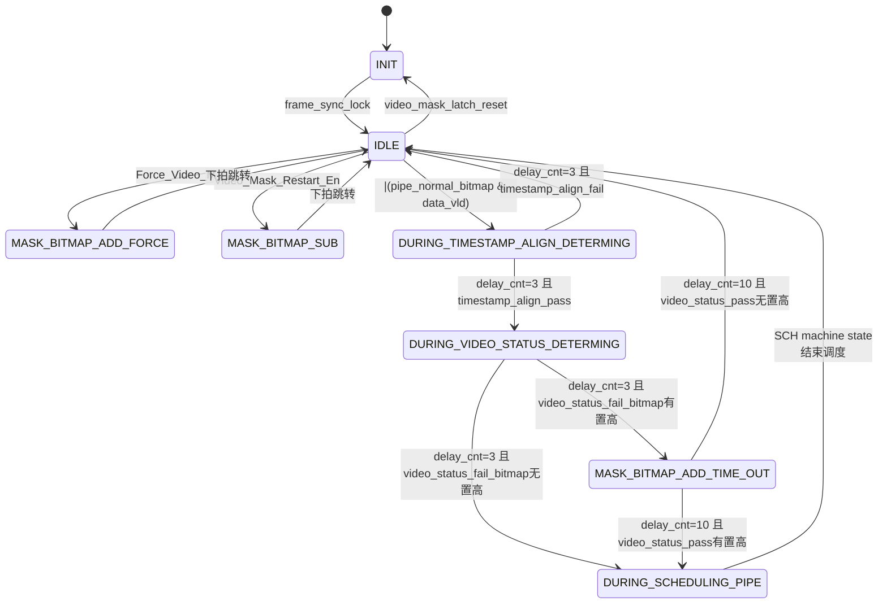
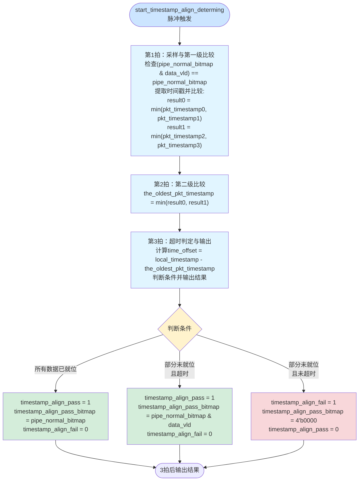

## 视频管道屏蔽详细设计 pipe_mask_ctrl

### 输入输出IO
| 端口名 | I/O | 位宽 | 描述 |
| :--- | :-: | :--- | :--- |
| `clk` | I | 1 | 入口时钟 |
| `rst_n` | I | 1 | 异步复位，低有效 |
| `pipe_concat_en`| I | 4 |   **【配置寄存器】**  同步汇聚pipe使能 |
| `Force_Video_Mask`| I | 4 |   **【配置寄存器】**  强制屏蔽-使能 |
| `Auto_Mask_En` | I | 4 |   **【配置寄存器】**  自动屏蔽-使能 |
| `Video_Mask_Restart_En` | I | 4 |    **【配置寄存器】**  自动屏蔽-退出屏蔽  |
| `frame_sync_lock`| I | 1 |  **【配置寄存器】** 帧锁定标志位 |
| `aggre_mode`| I | 2 | **【配置寄存器】** 汇聚模式  2'b01: 同步汇聚w4h模式   2'b10: 异步汇聚模式1  2'b11: 异步汇聚模式2|
| `video_mask_latch_reset`| I | 1 | **【配置寄存器】** 重置pipe_mask_bitmap到初始状态 |
| `pipe_mask_bitmap`| O | 4 | **【to video_pipe】** 控制video_pipe关断 |
| `start_sch_pulse`| O | 1 | **【to sch_concat】** 启动同步汇聚 |
| `end_sch_pulse`| I | 1 | **【from sch_concat】** 结束同步汇聚 |

### 原理

- 通过配置等信号实现本地 pipe_mask_bitmap 维护，同时输出 pipe_normal_bitmap 给 timstamp_align_determination 和 video_status_determination 两个模块进行mask检测，pipe_normal_bitmap = ~pipe_mask_bitmap & pipe_concat_en
- 子模块 timstamp_align_determination 通过检查4路fwft_fifo 的有效出口数据，判断pipe_normal_bitmap对应pipe的是否对齐成功
- 子模块 video_status_determination 通过检查 video_status_pass_bitmap 对应的匹配时

| 内部关键变量 | 类型 | 位宽 | 描述 |
| :--- | :-: | :--- | :--- |
| `pipe_normal_bitmap`| wire | 4 | 等于~pipe_mask_bitmap & pipe_concat_en |
| `data_vld`| wire | 4 | 4路fwft_fifo出口数据有效位，用于判断FIFO是否有有效数据 |
| `start_timestamp_align_determing `| wire | 1 |  next_state=DURING_TIMESTAMP_ALIGN_DETERMING触发该信号  |
| `timestamp_align_pass `| wire | 1 |  由timstamp_align_determination 输出  |
| `timestamp_align_fail `| wire | 1 |  由timstamp_align_determination 输出  |
| `timestamp_align_pass_bitmap `| wire | 4 |  由timstamp_align_determination 输出 pipe_normal_bitmap & data_vld  |
| `start_video_status_determing `| wire | 1 |  next_state=DURING_VIDEO_STATUS_DETERMING触发该信号  |
| `video_status_pass_bitmap `| reg | 4 |  由 video_status_determination 输出并锁存  |
| `video_status_fail_bitmap  `| reg| 4 |  由 video_status_determination 输出并锁存  |

### 状态机转换图

### 状态详细描述

- ### INIT：初始化状态

  - next触发：
    \-
  - curt跳转：
    等待frame_sync_lock和aggre_mode=2'b01信号，跳转至IDLE

- ### IDLE：空闲状态

  - next触发
    - 从INIT跳转，则重置pipe_mask_bitmap到初始状态
  - curt跳转：
    - 手动触发video_mask_latch_reset跳转至INIT
    - 手动触发Force_Video_Mask跳转至MASK_BITMAP_ADD_FORCE
    - 手动触发Video_Mask_Restart_En跳转至MASK_BITMAP_SUB
    - 条件触发(|(pipe_normal_bitmap & data_vld))跳转至DURING_TIMESTAMP_ALIGN_DETERMING

- ### DURING_TIMESTAMP_ALIGN_DETERMING ：视频包对齐工作状态
  
  - next触发：
    - 进行视频包对齐检测，仅检测当前 pipe_normal_bitmap 置高的pipe，计算过程需要3拍，delay_cnt进行计数
  - curt跳转：
    - delay_cnt=3时结束该状态，对齐成功 timestamp_align_pass 则携带 timestamp_align_pass_bitmap ，跳转至DURING_VIDEO_STATUS_DETERMING
    - delay_cnt=3时结束该状态，对齐失败timestamp_align_fail则跳转至IDLE

- ### DURING_VIDEO_STATUS_DETERMING：视频状态判断工作状态

  - next触发：
    - 进行视频状态判定，仅判定 video_status_pass_bitmap 至高的pipe, 计算过程需要3拍，
  - curt跳转：
    - delay_cnt=3时结束该状态， video_status_fail_bitmap 有置高，跳转至 MASK_BITMAP_ADD_TIME_OUT
    - delay_cnt=3时结束该状态， video_status_fail_bitmap 无置高，跳转至 DURING_SCHEDULING_PIPE

- ### DURING_SCHEDULING_PIPE：同步聚合工作状态

  - next触发：
    - 生成脉冲start_sch_pulse到状态机SCH machine state

  - curt跳转：
    - 等待同步汇聚调度状态机SCH machine state结束调度，跳转回IDLE

- ### MASK_BITMAP_ADD_TIME_OUT： pipe_mask_bitmap 置1状态

  - next触发：
    - 按位video_status_fail_bitmap, 进行pipe_mask_bitmap置1, 同时进行delay_cnt计数

  - curt跳转：
    - delay_cnt=10时结束该状态，video_status_pass有置高，跳转至 DURING_SCHEDULING_PIPE
    - delay_cnt=10时结束该状态，video_status_pass无置高，跳转至 IDLE

- ### MASK_BITMAP_ADD_FORCE：pipe_mask_bitmap置1状态

  - next触发：
    - pipe_mask_bitmap置1

  - curt跳转：
    下拍跳转至IDLE

- ### MASK_BITMAP_SUB：pipe_mask_bitmap清0状态

  - next触发：
    - pipe_mask_bitmap清0

  - curt跳转：
    下拍跳转至IDLE

### 子模块详细设计

#### 时戳对齐判定 timstamp_align_determination

##### 输入输出IO-时戳对齐判定

| 端口名 | I/O | 位宽 | 描述 |
| :--- | :-: | :--- | :--- |
| `clk` | I | 1 | 入口时钟 |
| `rst_n` | I | 1 | 异步复位，低有效 |
| `reg_sync_aggr_video_timeout_threshold` | I | 20 | 同步汇聚视频包等待超时阈值 |
| `pipe_normal_bitmap` | I | 4 | 指示哪些pipe需要检测 |
| `data_vld_0` | I | 1 | fwft_fifo_0出口数据有效位 |
| `data_vld_1` | I | 1 | fwft_fifo_1出口数据有效位 |
| `data_vld_2` | I | 1 | fwft_fifo_2出口数据有效位 |
| `data_vld_3` | I | 1 | fwft_fifo_3出口数据有效位 |
| `data_0` | I | 102 | fwft_fifo_0出口数据 |
| `data_1` | I | 102 | fwft_fifo_1出口数据 |
| `data_2` | I | 102 | fwft_fifo_2出口数据 |
| `data_3` | I | 102 | fwft_fifo_3出口数据 |
| `local_timestamp` | I | 80 | 当前本地us计数器值 |
| `start_timestamp_align_determing` | I | 1 | 开始进行时戳对齐判定 |
| `timestamp_align_pass` | O | 1 | 时戳对齐成功 |
| `timestamp_align_fail` | O | 1 | 时戳对齐失败 |
| `timestamp_align_pass_bitmap` | O | 4 |  表示时戳对齐成功时，对应的pipe位 |

##### 原理-时戳对齐判定

本模块通过比较4个fwft_fifo的空满状态和本地时戳,判断当前normal_pipe_bitmap中哪些pipe可以不再等待

**核心逻辑：**

1. **所有数据已就位：** 如果pipe_normal_bitmap对应的所有FIFO都非空（`(pipe_normal_bitmap & data_vld) == pipe_normal_bitmap`），直接判定对齐成功，交给后续逻辑判断包是否正确
2. **部分数据未就位：** 如果有FIFO为空（`data_vld`为0），则：
   - 从非空FIFO中找出最老的包时间戳（the_oldest_pkt_timestamp）
   - 计算：time_offset = local_timestamp - the_oldest_pkt_timestamp
   - 若 time_offset >= 阈值：说明未就位的pipe已经晚了很长时间，不再等待，输出align_pass
   - 若 time_offset < 阈值：可以继续等待，输出align_fail，状态机返回IDLE重新触发

**触发条件：**

- 顶层状态机在IDLE时，只要`pipe_normal_bitmap & data_vld`有任意位为1，就会触发`start_timestamp_align_determing`（脉冲信号）

**FIFO状态判断：**

- 采用FWFT（First Word Fall Through）FIFO，通过`data_vld`信号判断FIFO是否有有效数据
- `data_vld[i] = 1`表示FIFO_i有有效数据（非空）
- `data_vld[i] = 0`表示FIFO_i无有效数据（空）

**时间戳特性：**

- 80bit us计数器不会溢出回绕，足够运行多年
- 所有信号在统一时钟域下工作，无需跨时钟域处理

- 视频状态字段解析
fwft_fifo data[101:0]每bit含义
| 位域 | 描述 |
| :--- | :--- |
| `[79:0]` | pkt_timestamp[79:0]:接收到包结束时，us计数器的值（video_pipe模块中维护） |
| `[95:80]` | pkt_id[15:0]:接收到包的id,表示帧号或行号 |
| `[101:96]` | pkt_datatype[5:0]:接收到的包类型，含FS/FE/LONG_PACKET/LS/LE |

##### 数据处理流程图-时戳对齐判定

**流程图理解说明：**

本模块采用3拍流水线处理（从`start_timestamp_align_determing`脉冲触发开始计数，3拍后输出结果）：

- **第1拍：**
  - 采样输入信号，检查`(pipe_normal_bitmap & data_vld) == pipe_normal_bitmap`是否成立
  - 从有效FIFO（`pipe_normal_bitmap & data_vld`对应位为1）中提取时间戳字段
  - 进行第一级时间戳比较：`pkt_timestamp0 vs pkt_timestamp1`得到`result0`，`pkt_timestamp2 vs pkt_timestamp3`得到`result1`
- **第2拍：**
  - 完成第二级时间戳比较：`result0 vs result1`，找出最老的时间戳（the_oldest_pkt_timestamp）
- **第3拍：**
  - 计算`time_offset = local_timestamp - the_oldest_pkt_timestamp`
  - 判断输出结果：
    - 若`(pipe_normal_bitmap & data_vld) == pipe_normal_bitmap`：所有数据已就位，输出`timestamp_align_pass = 1, timestamp_align_pass_bitmap = pipe_normal_bitmap`
    - 若部分数据未就位且`time_offset >= threshold`：等待超时，输出`timestamp_align_pass = 1, timestamp_align_pass_bitmap = pipe_normal_bitmap & data_vld`
    - 若部分数据未就位且`time_offset < threshold`：继续等待，输出`timestamp_align_fail = 1, timestamp_align_pass_bitmap = 4'b0000`

**关键实现细节：**

- **触发机制：** `start_timestamp_align_determing`为脉冲信号，从IDLE状态触发时需满足`|(pipe_normal_bitmap & data_vld)`
- **流水线延迟：** 固定3拍流水线，无预检查快速通路，统一在第3拍输出结果
- **比较器资源：** 使用3个80bit比较器进行流水线比较（找出最老的包时间戳）
- **减法器：** 1个80bit减法器计算time_offset = local_timestamp - the_oldest_pkt_timestamp
- **阈值比较：** 1个80bit比较器判断是否超过阈值，阈值扩展到80bit：`time_offset >= {60'b0, reg_sync_aggr_video_timeout_threshold}`
- **输出bitmap：**
  - 所有数据就位时：`timestamp_align_pass_bitmap = pipe_normal_bitmap`
  - 部分数据超时时：`timestamp_align_pass_bitmap = pipe_normal_bitmap & data_vld`
  - 继续等待时：`timestamp_align_pass_bitmap = 4'b0000`
- **复位行为：** 异步复位`rst_n`时：
  - `timestamp_align_pass = 1'b0`
  - `timestamp_align_fail = 1'b1`（默认失败状态，等待触发）
  - `timestamp_align_pass_bitmap = 4'b0000`
- **时钟域：** 所有信号在统一时钟域下工作，无CDC问题
- **时间戳提取：** 直接使用`data[79:0]`作为时间戳，无需额外字段校验
